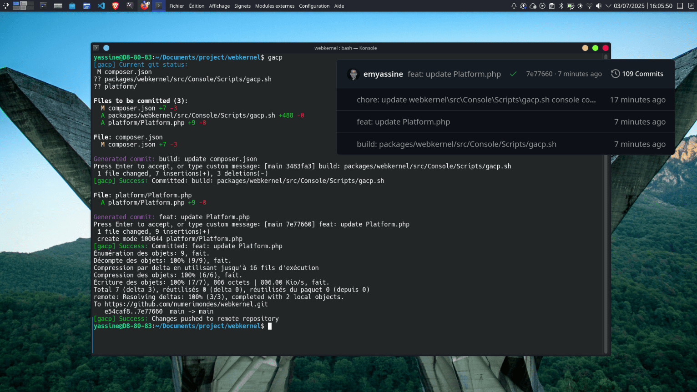

# GACP - Git Add Commit Push
A one-word command from Heaven for your terminal that saves you time — add, commit, and push all in one go. **GACP** is an intelligent Git automation tool that streamlines your development workflow. It automatically generates conventional commit messages and handles the full `git add`, `commit`, and `push` process — all in one go.

## Installation

### Quick One-Line Installer

```bash
curl -sL https://raw.githubusercontent.com/numerimondes/gacp/refs/heads/main/gacp.sh -o gacp.sh && chmod +x gacp.sh && ./gacp.sh --install-now
```
<br>




By default, **GACP** creates a separate commit for each modified file.
To group all changes into a single commit, simply run: ```bash gacp -g```

## Features

- **Intelligent Commit Messages**: Automatically generates meaningful commit messages based on file changes
- **Conventional Commits**: Supports and enforces conventional commit standards
- **Project Awareness**: Smart detection for Laravel/PHP, Node.js, Python, and other project types
- **Individual File Commits**: Commits files individually by default for better history tracking
- **Automatic Branch Setup**: Handles upstream branch configuration automatically
- **Auto-Update**: Built-in update mechanism to keep GACP current
- **Colorized Output**: Beautiful, informative terminal output with color coding

> Updates still have some issues sometimes

## Usage

### Basic Usage

```bash
gacp                    # Commit files individually (default)
gacp -g                 # Group all changes into a single commit
gacp -h                 # Show help message
gacp -v                 # Show version and check for updates
gacp --update-now       # Update to latest version
```

### Getting Started

1. **Initialize a new repository:**
```bash
git init
git add .
gacp
```

2. **In an existing repository:**
```bash
# Make your changes
gacp                    # Automatically handles add, commit, and push
```

3. **Group multiple changes:**
```bash
gacp -g                 # Commits all changes in a single commit
```

## How It Works

### Intelligent Message Generation

GACP analyzes your changes and generates appropriate commit messages:

- **PHP/Laravel Projects**: Detects models, controllers, services, migrations, and routes
- **Node.js Projects**: Recognizes components, functions, and dependencies
- **General Projects**: Analyzes file types and change patterns

### Conventional Commits

All generated messages follow conventional commit standards:

- `feat:` for new features
- `fix:` for bug fixes
- `docs:` for documentation
- `style:` for formatting changes
- `refactor:` for code refactoring
- `test:` for adding tests
- `chore:` for maintenance tasks

### Example Outputs

```bash
# Single file changes
feat: add User model
fix: resolve authentication middleware issue
docs: update API documentation

# Multiple file changes
feat: implement user authentication system
refactor: update 3 controller classes
chore: update package dependencies
```

## Project Type Detection

GACP automatically detects your project type and adjusts its behavior:

### PHP/Laravel (made for)
- Models, Controllers, Services, Repositories
- Migrations, Routes, Middleware
- Composer dependencies
- PSR-4 namespace awareness

### Node.js
- Components, Functions, Classes
- Package.json changes
- Import/require statements

### Python
- Classes, Functions, Modules
- Requirements.txt, setup.py
- Virtual environment files

### Other Supported Types
- Rust (Cargo.toml)
- Go (go.mod)
- Java (Maven/Gradle)
- C# (.NET projects)

## Commands Reference 

| Command | Description |
|---------|-------------|
| `gacp` | Default: commit files individually |
| `gacp -g` | Group all changes into single commit |
| `gacp -h` | Show help message |
| `gacp -v` | Show version and check for updates |
| `gacp --update-now` | Update to latest version |
| `gacp --install-now` | Install GACP globally |

## File Change Indicators

GACP shows clear indicators for different file states:

- `M` Modified files (yellow)
- `A` Added files (green)
- `D` Deleted files (red)
- `R` Renamed files (cyan)
- `?` Untracked files (blue)

## Requirements

- Git (obviously!)
- Bash shell
- curl (for installation and updates)
- Terminal with color support (recommended)

## Advanced Features

### Auto-Update System
GACP checks for updates and can automatically update itself:

```bash
gacp -v                 # Check for updates
gacp --update-now       # Force update
```

### Custom Commit Messages
You can always override the generated message:

```bash
# GACP will prompt for custom message
gacp
# > Generated: feat: add User model
# > Press Enter to accept, or type custom message: fix: resolve user validation
```

### Branch Management
GACP automatically handles upstream branch setup:

```bash
# First push to new branch
gacp  # Automatically runs: git push -u origin branch-name

# Subsequent pushes
gacp  # Simple: git push
```

## Troubleshooting

### Not in a Git Repository
If you're not in a git repository, GACP will show helpful guidance:

```bash
# Initialize new repository
git init
git add .
gacp

# Clone existing repository
git clone <repository-url>
cd <repository-name>
gacp
```

### Installation Issues
If installation fails, try manual installation:

```bash
# Download and install manually
curl -sL https://raw.githubusercontent.com/numerimondes/gacp/refs/heads/main/gacp.sh -o ~/.gacp/gacp.sh
chmod +x ~/.gacp/gacp.sh
echo 'source ~/.gacp/gacp.sh' >> ~/.bashrc
source ~/.bashrc
```

### Update Issues
If auto-update fails, reinstall:

```bash
curl -sL https://raw.githubusercontent.com/numerimondes/gacp/refs/heads/main/gacp.sh -o gacp.sh && chmod +x gacp.sh && ./gacp.sh --install-now
```

## Contributing

GACP is open source and welcomes contributions! The project follows conventional commits and maintains high code quality standards.

## License

MIT License - feel free to use GACP in your projects!

## Credits

**El Moumen Yassine**
**yassine@numerimondes.com**
**❤️ Made with love by numerimondes**

---

*Save time, commit better, code happier with GACP !*